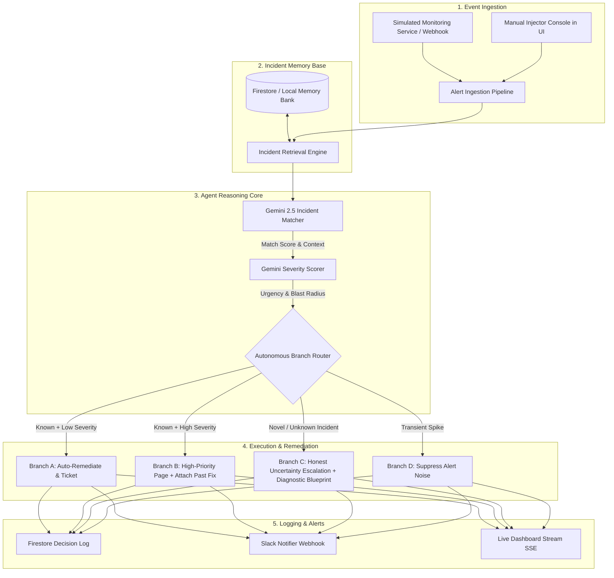

# ⚡ Muscle Memory — Autonomous Production Incident Coordinator Agent

> **Taskmaster Track Hackathon Project**  
> *An autonomous agent that recognizes, diagnoses, and routes production incidents like an expert SRE who's seen it before.*

---

## 🔗 Project Links & Quick Access

* 💻 **GitHub Repository**: [https://github.com/Saadi2004/Muscle-Memory](https://github.com/Saadi2004/Muscle-Memory)
* 🌐 **Live Demo Dashboard**: `http://localhost:5173` (via `run_all.bat` or Cloud Run)
* 📄 **Technical Project Guide**: [`PROJECT_GUIDE.md`](./PROJECT_GUIDE.md)
* 🎬 **Demo Video Walkthrough**: [Link to YouTube / Loom Demo Video]

---

## 🌟 Overview

Handling production alerts is traditionally a slow, manual, and repetitive chore: an on-call engineer gets paged, guesses whether the issue has occurred before, assesses urgency, searches for past runbooks, and notifies stakeholders.

**Muscle Memory** solves this end-to-end as an **autonomous event-driven coordinator agent**. When a monitoring alert triggers, Muscle Memory:
1. **Searches Historical Incident Memory**: Evaluates symptoms, error signatures, and stack traces against historical resolved incidents using Google Gemini 2.5 Flash.
2. **Calculates Multidimensional Severity**: Analyzes blast radius, error rate velocity, service criticality tier, and SLA breach imminence.
3. **Executes Autonomous 3-Way Branching**:
   - **Branch A (Known + Low/Med Severity)**: Auto-executes proven remediation scripts (e.g. restarts connection pooler, rolls back canary), files a low-priority tracking ticket, and sends a calm status update.
   - **Branch B (Known + High/Critical Severity)**: Dispatches an urgent on-call page with the past root-cause analysis and copy-pasteable resolution command pre-packaged.
   - **Branch C (Novel / Unknown Incident)**: Demonstrates **honest uncertainty**; avoids hallucinating fixes, provides a diagnostic investigation blueprint, and escalates to the lead SRE.
   - **Branch D (Transient Noise)**: Suppresses noise for non-impacting transient spikes.
4. **Learning Feedback Loop**: Allows SREs to promote resolved novel incidents into Muscle Memory's knowledge bank with a single click.

---

## 🏗️ Architecture



---

## 🎯 Pre-Built Demo Scenarios

| Scenario | Incident Signature | Expected Agent Behavior | Autonomous Action |
| :--- | :--- | :--- | :--- |
| **Scenario 1: Redis Pool Exhaustion** | Connection exhaustion on cache cluster node | Exact match ($\ge 90\%$), P2 Severity | **Branch A**: Auto-executes stale connection reaper script, files Jira ticket, logs calm status. |
| **Scenario 2: DB Replica Lag Surge** | PostgreSQL replication lag $> 180\text{s}$ | Known Critical ($\ge 85\%$), P0 Severity | **Branch B**: Urgent page to on-call with historical SQL kill command and post-mortem attached. |
| **Scenario 3: Novel Auth Memory Leak** | Anomalous 502 Bad Gateway surge in JWT parser | Unmatched ($< 45\%$), Novel Anomaly | **Branch C**: Flags honest uncertainty, generates diagnostic queries, alerts lead SRE. |
| **Scenario 4: Transient CPU Spike** | Worker CPU spike for $<10$ seconds | Non-persistent metric blip | **Branch D**: Suppresses noise, prevents alert fatigue. |
| **Scenario 5: Webhook Signature Desync** | Stripe webhook 400 Bad Request error surge | Known match ($\ge 80\%$), P2 Severity | **Branch A**: Syncs new secret from Secret Manager and hot-reloads deployment. |

---

## 💻 Tech Stack

- **Reasoning Engine**: Google Gemini 2.5 Flash (`google-genai` SDK) with heuristic offline fallback.
- **Backend & Event Router**: FastAPI, Pydantic v2, Google Cloud Firestore, Server-Sent Events (SSE), Python 3.11+.
- **Frontend Command Center**: React 19, TypeScript, Vite, Tailwind CSS v4, Lucide Icons, Canvas Confetti.
- **Integrations**: Slack Block Kit Webhooks, Jira/GitHub ticket tracking format, Docker & Cloud Run ready.

---

## 🚀 Getting Started

### 1. Prerequisites
- Python 3.10+
- Node.js 18+ and npm

### 2. Quickstart (One-Click)

On Windows, simply run:
```bash
run_all.bat
```

Or manually in two separate terminal windows:

#### Terminal 1 — Backend:
```bash
# Set up Python virtual environment
python -m venv .venv
.venv\Scripts\activate      # Windows (.venv/bin/activate on Linux/Mac)
pip install -r backend/requirements.txt

# Start backend API server
uvicorn backend.app.main:app --host 0.0.0.0 --port 8000 --reload
```

#### Terminal 2 — Frontend:
```bash
cd frontend
npm install
npm run dev
```

Open **http://localhost:5173** to access the **Muscle Memory Live Command Center**.

---

## ⚙️ Configuration (`backend/.env`)

```env
# Google Gemini API Key (Optional: live LLM reasoning; deterministic heuristic fallback used if empty)
GEMINI_API_KEY=your_gemini_api_key_here

# Google Cloud Firestore (Optional: cloud persistence; fallback to local JSON database if empty)
GCP_PROJECT_ID=
GOOGLE_APPLICATION_CREDENTIALS=

# Slack Webhook (Optional: posts rich Block Kit alerts directly to your Slack channel)
SLACK_WEBHOOK_URL=https://hooks.slack.com/services/...
```

---

## 🧪 Running Automated Tests

Run backend unit tests verifying all 4 autonomous routing branches and incident matching logic:

```bash
.venv\Scripts\pytest.exe backend/tests -v
```

---

## ☁️ Deploying to Google Cloud Run

Build and deploy the backend service to Cloud Run:

```bash
gcloud run deploy muscle-memory-backend \
  --source ./backend \
  --platform managed \
  --region us-central1 \
  --allow-unauthenticated \
  --set-env-vars GEMINI_API_KEY="your_api_key"
```

---

## 👥 Team & Submission Notes
- **Track**: Taskmaster Track
- **Core Value Proposition**: Real branching decision-making with calibrated honest uncertainty, replacing hours of manual triage with autonomous, verifiable action.
